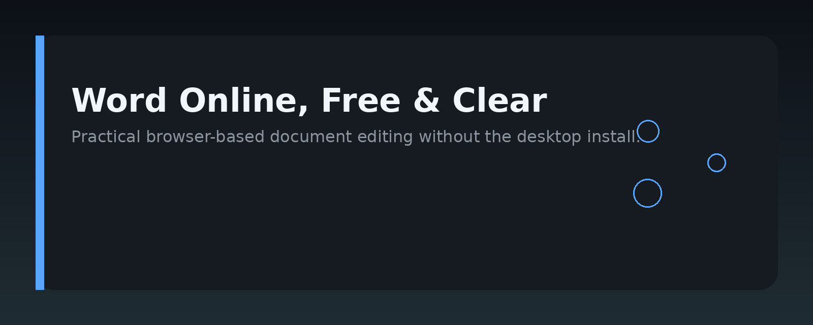
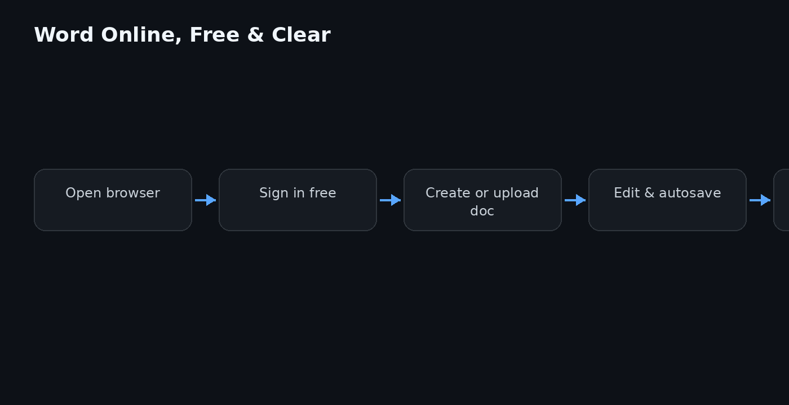

# Word Online Free: A Practical Handbook




## Overview

This repository is a practical, hands-on guide for people who use Microsoft Word online for free, without a paid subscription. It collects the workflows, shortcuts, formatting tricks, and collaboration patterns that are actually useful when you are working in a browser instead of a desktop app.

The handbook is built around the free tier of Word on the web: what you can do, what you cannot do, and how to work around the gaps. It is not an official Microsoft document. It is a community-maintained set of notes, scripts, and templates that make the free web version more productive.

## Why it exists

Word Online free is a capable tool, but its limits are rarely explained up front. Many people open it, hit a missing feature, and assume the whole product is broken. This handbook exists to close that gap.

The goals are simple:

- Show what the free version actually includes.
- Provide copy-paste workflows for common tasks like formatting, reviewing, and sharing.
- Give real workarounds for features that are desktop-only.
- Keep everything reproducible, so you can verify each tip yourself.

No affiliate links, no star counts, no marketing. Just the technical reality of using Word online for free.

## Core concepts

### Free tier vs. paid tier

The free web version of Word runs in your browser. You do not need a Microsoft 365 subscription to use it. You only need a Microsoft account. The main differences from the desktop app:

- **No offline editing** — you need a connection to save changes.
- **Reduced formatting controls** — some advanced layout options are missing.
- **No add-ins** — third-party extensions are not available in the free web tier.
- **Collaboration is real-time** — multiple users can edit the same document simultaneously.

### File compatibility

Word Online free handles `.docx`, `.doc`, `.odt`, and `.rtf` files. Opening a legacy `.doc` file works, but complex formatting may shift. The safest path is to convert everything to `.docx` before heavy editing.

### Autosave and version history

Autosave is always on in the web version when you are working on a file stored in OneDrive. Version history is available through **File → Info → Version History**, and it keeps a snapshot each time you stop editing for a few minutes.

### Collaboration model

Sharing is done through a link. You control whether viewers can edit or only comment. The free tier does not give you granular permission settings like "block download" — that is a paid feature.

## Architecture

The handbook is organized as a set of Markdown files plus a small set of reusable assets.

```
word-web-handbook/
├── README.md               # this file
├── assets/
│   ├── banner.png          # repo banner
│   └── architecture.png    # diagram of the workflow
├── guides/
│   ├── formatting.md       # text and paragraph controls
│   ├── collaboration.md    # sharing and co-authoring
│   ├── export.md           # converting to PDF and other formats
│   └── workarounds.md      # desktop-only feature replacements
├── templates/
│   ├── report.docx         # blank report template
│   └── meeting-notes.docx  # simple meeting notes template
└── scripts/
    └── convert-to-pdf.py   # local helper for batch conversion
```

The architecture diagram shows the flow: you open a document in the browser, edit it with the available controls, save automatically to OneDrive, and share a link for collaboration. The local scripts in this repo are optional helpers for tasks the web version cannot do, like batch converting many files at once.

## Practical workflow

### 1. Create a document

1. Go to [office.com](https://www.office.com) and sign in with a Microsoft account.
2. Choose **Word** from the app grid.
3. Select **Blank document** or pick a template.
4. The document is saved to OneDrive automatically.

### 2. Format text

Use the toolbar at the top. The free version includes:

- Font, size, bold, italic, underline
- Bullet and numbered lists
- Alignment (left, center, right, justify)
- Line spacing
- Highlight and font color
- Insert hyperlinks, images, tables, and headers/footers

### 3. Collaborate

1. Click **Share** in the top-right corner.
2. Choose **Anyone with the link can edit** or **...can comment**.
3. Copy the link and send it.
4. Watch edits appear in real time. Each collaborator's cursor is a colored marker.

### 4. Export to PDF

1. Open the document.
2. Go to **File → Save As → Download as PDF**.
3. The browser downloads the PDF version.

This works in the free tier and is the most reliable way to produce a fixed layout for printing or sending to someone who does not use Word.

## Examples

### Copy-paste a clean table

The web editor sometimes strips formatting when pasting from other sources. This Markdown table converts cleanly into a Word table if you paste it into a document and then use **Insert → Table → Convert Text to Table**.

```markdown
| Feature            | Free web version | Desktop app |
|--------------------|------------------|-------------|
| Real-time editing  | Yes              | Yes         |
| Offline editing    | No               | Yes         |
| Add-ins            | No               | Yes         |
| Version history    | Yes              | Yes         |
| PDF export         | Yes              | Yes         |
```

### Batch convert DOCX to PDF (local helper)

The web version cannot convert multiple files at once. This Python script uses `docx2pdf` locally to do the job.

```python
# scripts/convert-to-pdf.py
import os
from docx2pdf import convert

folder = "path/to/your/docx/files"
for filename in os.listdir(folder):
    if filename.endswith(".docx"):
        full_path = os.path.join(folder, filename)
        convert(full_path)
        print(f"Converted: {filename}")
```

Install the dependency first:

```bash
pip install docx2pdf
```

### Simple mail merge workaround

The free web version has no mail merge. If you need to send the same letter to many people, use a table and a script to generate individual files.

```python
# scripts/mail-merge.py
from docx import Document

people = [
    {"name": "Alice", "city": "Berlin"},
    {"name": "Bob", "city": "Paris"},
]

for person in people:
    doc = Document()
    doc.add_paragraph(f"Dear {person['name']},")
    doc.add_paragraph(f"We are writing to you from {person['city']}.")
    doc.save(f"letter-{person['name'].lower()}.docx")
```

## FAQ

**Is Word Online free really free?**

Yes. You need a Microsoft account, but no subscription. The free tier is the browser version with a reduced feature set.

**Can I use it offline?**

No. The free web version requires a connection to save changes. The desktop app supports offline editing, but that is a paid feature.

**Can I open `.doc` files?**

Yes, but older `.doc` files may lose some formatting. Convert them to `.docx` first for best results.

**Can I collaborate with someone who has the paid version?**

Yes. Sharing works across free and paid accounts. The paid user may see extra features, but the free user can still edit the shared document.

**Can I install add-ins?**

No. Add-ins are not available in the free web tier.

**How do I get a PDF?**

Use **File → Save As → Download as PDF**. This works in the free version.

**Is there a mobile app for the free tier?**

Yes, the Word mobile app is free to download and use for basic editing, but it also has limitations compared to the desktop version.

## License MIT

This project is licensed under the MIT License. You are free to use, modify, and distribute the content, provided you include the original copyright notice. See the [LICENSE](LICENSE) file for the full text.

Topic: `word-online-guide-kit`
